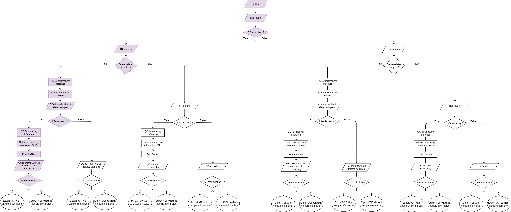

# VCF Processing Pipeline

This pipeline generates a VCF annotated with allele frequencies stratified by ancestry and sex. It is designed to facilitate downstream analyses that require population-aware frequency data. The pipeline consists of the following main modules:

- Variant, Genotype, and Sample Quality Control

- Sex Inference

- Ancestry Inference

- Allele Frequency Recalculation and Annotation by Ancestry and Sex

The final output will be a VCF file with all population allele frequencies (`AF`) and supporting metrics annotated:

```
AF_total_recalc
AC_total_recalc
AC_hom_total_recalc
AN_total_recalc
AF_male_recalc
AC_male_recalc
AC_hom_male_recalc
AN_male_recalc
AF_female_recalc
AC_female_recalc
AC_hom_female_recalc
AN_female_recalc
AF_pop_n_recalc
AC_pop_n_recalc
AC_hom_pop_n_recalc
AN_pop_n_recalc
```

**Bear in mind that the original AF values (if present in the input VCF) are NOT deleted, the output VCF will have the original AFs and the recalc ones.**

**Note:**  
If sex and ancestry cannot be inferred from genomic data, sex-based and ancestry-based grouping will be skipped.

## Requirements

### 1. Install Hail 

On a recent Debian-like system, the following should suffice

```
apt-get install -y \
    openjdk-11-jre-headless \
    g++ \
    python3.9 python3-pip \
    libopenblas-base liblapack3
python3.9 -m pip install hail
```

If more information is, please visit [Hail's documentation page](https://hail.is/docs/0.2/getting_started.html).

### 2. Install Required Python Packages

This workflow is written in Python and requires the following additional packages: 

- PyYAML
- pandas

You can install them using `pip`: 

```
pip install PyYAML pandas
```

### 3. CHARR Contamination Filtering Reference

If you plan to run CHARR contamination filtering (recommended), you’ll need to download the reference database for the genome version of your data. Bear in mind that, if all your data belongs to the same version, you'll only need to download that reference. 

* **If your data was aligned to GRCh37**

To check the size and contents of the folder before downloading:

```
gsutil ls -l gs://gcp-public-data--gnomad/release/2.1.1/ht/genomes/gnomad.genomes.r2.1.1.sites.ht/
```

To download the reference data: 

```
gsutil cp -r gs://gcp-public-data--gnomad/release/2.1.1/ht/genomes/gnomad.genomes.r2.1.1.sites.ht/ .
```

* **If your data was aligned to GRCh38**

To check the size and contents of the folder before downloading:

```
gsutil ls -l gs://gcp-public-data--gnomad/release/4.1/ht/genomes/gnomad.genomes.v4.1.sites.ht/
```

To download the reference data: 

```
gsutil cp -r gs://gcp-public-data--gnomad/release/4.1/ht/genomes/gnomad.genomes.v4.1.sites.ht/ .
```

## Module Overview

### MODULE 1: Preprocessing

#### Step 1: Convert VCF to Hail MatrixTable

Convert all VCF files in a folder into a single Hail MatrixTable for downstream processing.

#### Step 2: Split Multi-Allelic Variants

#### Step 3: Variant Quality Control

Apply the following quality filters:

| Metric                   | Threshold         | Description                                                                                 |
|---------------------------|--------------------|---------------------------------------------------------------------------------------------|
| Quality by Depth (`QD`)   | `< 2.0`            | Variant quality normalized by depth.                                                       |
| Depth of Coverage (`DP`)  | `< 15`             | Total sequencing reads supporting the position.                                            |
| Variant Quality (`QUAL`)  | `< 30`             | Confidence score for the variant.                                                          |
| Mapping Quality (`MQ`)    | `< 40`             | Read alignment confidence.                                                                 |
| Fisher Strand Bias (`FS`) | `> 60`             | Measures strand bias in sequencing reads.                                                  |
| Read Position Bias        | `< -8.0`           | Measures whether alleles occur at read ends (potential bias).                              |

*Note:* The VCF must include read-level information (DP, GQ, MQ, FS, etc.) for these filters to work.

#### Step 4: Genotype Quality Control

Apply the following quality filters:

| Metric                   | Threshold         | Description                                                                                 |
|---------------------------|--------------------|---------------------------------------------------------------------------------------------|
| Genotype Quality (`GQ`)   | `< 20`             | Confidence in the assigned genotype. 
| Allele Balance (`AB`)     | `< 0.2`            | Ratio of alternative reads to total reads.                                                 |                                                      |

*Note:* The VCF must include genotype-level information (GQ and AD) for these filters to work.

#### Step 5: Sample Quality Control

| Metric                                | Threshold                      | Description                                                                                   |
| ------------------------------------- | ------------------------------ | --------------------------------------------------------------------------------------------- |
| Minimum Coverage                      | `WGS < 15 ; WES < 10`            | Minimum acceptable read depth per sample; ensures sufficient coverage.                        |
| Transition/Transversion Ratio (Ti/Tv) | `WGS: \~2.0–2.1; WES: \~3.0–3.3` | Expected ratio of transitions to transversions, indicating variant quality.                   |
| Het/Hom Ratio                         | `WGS > 3.3; WES > 10`            | Ratio of heterozygous to homozygous variants; detects abnormal variant patterns.              |
| Call Rate                             | `< 95%`                       | Proportion of variants successfully genotyped; low values suggest poor-quality samples.       |
| Singletons                            | `WGS > 100k; WES > 5k `          | Number of variants found only once in the dataset |
| Contamination (CHARR)                 | `WGS > 5%; WES > 0.015%  `       | Estimate of contamination in the sample.                  |

#### Step 6: Sex Inference

Infer sample sex using its genomic information. If sex cannot be determined, sex-based grouping will be skipped.

### MODULE 2: Delete related samples

Including related individuals in a cohort can distort AF calculations

### MODULE 3: Ancestry

#### Ancestry Inference

**Subset Hail Matrix for Ancestry SNPs**  
Extract ~282,424 ancestry-informative SNPs (if available).

**Run GRAF-Anc**  
Use GRAF-Anc for ancestry assignment.

**Process GRAF-Anc Results**  
GRAF-Anc assigns ancestry at two levels:

- **Continental**
- **Subcontinental**

Only the **continental level** will be used to ensure reliable population tagging, aligned with gnomAD v4 practices.

| Code | Description                  | gnomAD Equivalent                |
|------|------------------------------|----------------------------------|
| AFR  | African                      | African / African American       |
| MEN  | Middle East and North Africa | Middle Eastern                   |
| EUR  | European                     | Non-Finnish European             |
| SAS  | South Asian                  | South Asian                      |
| EAS  | East Asian                   | East Asian                       |
| AMR  | Admixed American             | Admixed American                 |
| OCN  | Oceania                      | —                                |
| MIX  | Multi-ancestry               | Remaining samples                |

*Note:* GRAF-Anc does **not** tag: Ashkenazi Jewish, Amish, or Finnish populations.

If there are not enought ancestry-informative SNPs in the input VCF the ancestry-based grouping will be skipped. 

### MODULE 4: Allele Frequency Recalculation

Calculate `AF`, `AC`, `AC_hom`, and `AN` for:

- Total population
- Males
- Females
- Each ancestry group

And finally, export a single VCFs with all the AF fields annotated. 

## HOW TO RUN THE PIPELINE

All parameters and module executions are controlled via `config.yaml`. Example:

```yaml
## PATHS
vcf_dir : " " # all the VCFs in this folder will be converted to a Hail matrix. They must be from the same reference genome.
ref_gen : " " # reference genome from the VCFs (OPTIONS: GRCh37 / GRCh38)
mt_from_vcf : " " # path where the original matrix will be saved
seq_type : " " # sequencing type (OPTIONS: WGS / WES)
mt_afterQC : " " # path where the after QC matrix will be
gnomad_sites : "" # path where gnomad.genomes.r2.1.1.sites.ht has been downloaded

## LOGs
verbosity : true # if true a csv with variants deleted per step will be create. This increases the execution time.


## MODULES TO RUN
preprocessing : true # if true the module will be run# Compute CHARR
split_multiallelic : true
genotype_filtering : true# Compute CHARR
variant_filtering : true
sample_filtering : true
# Compute CHARR
## VARIANT FILTERING THRESHOLDS
variant_filters:
  QD_threshold : 2.0 # threshold used during t# Compute CHARRhe QC
  DP_threshold : 15 
  QUAL_threshold : 40
  MQ_threshold : 40
  FS_threshold : 60
  READPOSRANKSUM_threshold : -8.0

## GENOTYPE FILTERING THRESHOLDS 
genotype_filters:
  GQ_threshold : 20
  AB_threshold : 0.2

## SAMPLE FILTERING THRESHOLDS
sample_filters:  
  DP_STATS.MEAN_WGS_threshold : 15
  DP_STATS.MEAN_WES_threshold : 10
  CALL_RATE_threshold : 0.95
  R_HET_HOM_VAR_WES_threshold : 10 
  R_HET_HOM_VAR_WGS_threshold : 3.3
  N_SINGLETON_WGS_threshold : 100000
  N_SINGLETON_WES_threshold : 5000 
  CHARR_threshold : 0.05
  R_TI_TV_WES_threshold : [3.0 , 3.3]
  R_TI_TV_WGS_threshold : [2.0 , 2.1]

## ANCESTRY
ancestrySNPs : "path/to/GrafAnc_SNPs/" # update with your local path of GrafAnc_SNPs (Downloaded when cloning this repo)

## AF RECALC
final_vcf_AF : " " # path for VCF annotated with AFs
summary_VCF : false # if true the output VCF wont contain ANY information about the samples and their genotypes

## SPARK CONFIGURATION 

# To work with big datasets allocating the available memory into spark avoids crashes. 

spark_diver_memory: "50g" # Allocate sufficient memory for the driver
spark_executor_memory : "20g" # Allocate memory for executors
spark_executor_memory: 4 # Use multiple executors
spark_executor_cores: 4 # Assign cores per executor
spark_rpc_askTimeout': "300s" # Increase timeout for slow operations
spark_sql_shuffle_partitions: 200 # Reduce shuffle partitions for large data
spark_memory_fraction: 0.8 # Use most of the JVM heap for Spark execution
spark_local_dir: "./tmp" # Specify a temp directory for disk spill
spark_network_timeout: 800s # Avoid network timeouts
tmp_dir: "./tmp"
local_tmpdir: "./tmp"

```

---

**Modular Design:**  

Each module and function can be run independently:
- If a module is set to False, it will be skipped
- If a preprocessing step is set to False it will be skipped
- Thresholds can be adjusted via `config.yaml`. If a threshold is not set, that filtering step will be skipped. 

---


**Once the `conf.py` is adjusted to your needs, you only need to run:**

```
python vcf-af-pipeline.py
```
In the pipeline diagram you'll find the different paths your data can follow with this pipeline. In purple you'll find highlighted our proposed path, where all the quality control steps are performed, related samples are deleted and ancestry is inferred. 

